# Design and Implementation of an Explainable Machine Learning Model for Financial Fraud Detection

## Abstract

Credit-card fraud detection is a rare-event classification problem in which a model can achieve very high accuracy while failing to identify fraudulent transactions. This dissertation designs, implements, and evaluates a reproducible and explainable machine-learning prototype using a public dataset of 284,807 European card transactions. After removing 1,081 exact duplicate rows, a stratified 80/20 split produced 226,980 training observations and a locked test set of 56,746 observations. Logistic Regression, Decision Tree, and Random Forest classifiers were compared using leakage-safe five-fold cross-validation. Class weighting, a bounded set of hyperparameters, a `log1p` amount transformation, and fold-contained SMOTE were investigated on the training partition. Average precision, reported as PR-AUC, was the primary selection measure.

A balanced Random Forest with 200 trees achieved the strongest mean cross-validated PR-AUC of 0.8368 and was selected. An operating threshold of 0.485 was fixed by maximum out-of-fold F1 before the test set was evaluated. On the untouched test partition, the model achieved precision of 0.9583, recall of 0.7263, F1-score of 0.8263, ROC-AUC of 0.9428, and PR-AUC of 0.8148, with 69 true positives, three false positives, 26 false negatives, and 56,648 true negatives. SHAP analysis identified V12, V14, V4, V3, V11, V10, and V17 as the most influential features globally and produced additive local explanations for representative correct and incorrect decisions. A tested Streamlit application demonstrates inference using the immutable fitted pipeline and frozen threshold. The findings show that precision-recall evaluation, leakage control, explicit threshold selection, and model-level explanation are essential in this highly imbalanced setting. The prototype is suitable as an academic demonstration but not as a production banking system without external validation, calibration, monitoring, security, and governance controls.

**Keywords:** credit-card fraud; imbalanced classification; Random Forest; precision-recall; SHAP; explainable artificial intelligence

## Chapter 1 Introduction

### Background

Financial transaction fraud creates a classification problem in which fraudulent observations are substantially rarer than legitimate observations. A detector must distinguish a small minority of important cases from a large legitimate population while controlling both missed fraud and unnecessary investigations. Overall accuracy can therefore conceal poor fraud detection: a classifier that labels every transaction as legitimate would exceed 99.8% accuracy on the raw dataset used in this study while detecting no fraud. Precision, recall, F1-score, ROC-AUC, and precision-recall area must consequently be considered alongside accuracy.

The practical setting is also dynamic. Fraud patterns may change, labels can be delayed, and the costs of false positives and false negatives are unequal and institution-specific (Dal Pozzolo et al., 2018). This dissertation does not claim to solve those deployment challenges. It instead establishes a controlled experimental pipeline in which the data split, preprocessing, imbalance strategy, model selection, threshold selection, final evaluation, and explanation stages are separated and recorded.

Explainability is included because a high-performing classifier alone does not show why a particular transaction received a high score. SHAP provides additive feature attributions for individual predictions and can also be aggregated to describe global model behaviour (Lundberg and Lee, 2017). In this dataset, however, V1 through V28 are anonymized. The analysis can therefore identify influential mathematical variables and directions of contribution, but it cannot assign them unsupported business meanings.

### Problem statement

Severe class imbalance makes naive accuracy-driven model comparison unreliable, while flexible nonlinear models can be difficult to interpret. A defensible academic prototype must therefore answer four linked problems: how to compare candidate algorithms without contaminating the test set; how to investigate imbalance handling without leakage; how to choose an operating threshold explicitly; and how to explain the selected model without presenting association as causation. The project addresses these problems using reproducible artifacts and one final evaluation of a frozen model.

### Aim

The aim is to design and implement a reproducible and explainable machine-learning prototype for classifying credit-card transactions as fraudulent or legitimate.

### Objectives

1. Inspect and prepare the supplied transaction dataset.
2. Compare Logistic Regression, Decision Tree, and Random Forest classifiers.
3. Investigate the effect of severe class imbalance on model performance.
4. Select a final model and operating threshold using training evidence only.
5. Apply SHAP to explain global model behaviour and individual predictions.
6. Develop a simple Streamlit research demonstration.

### Research questions

1. How effectively can the selected machine-learning algorithms classify transactions as fraudulent or legitimate?
2. How do Logistic Regression, Decision Tree, and Random Forest compare?
3. How does severe class imbalance affect their performance?
4. Which anonymized features most strongly influence the final model's predictions?
5. To what extent can SHAP provide understandable individual explanations?

### Scope and limitations

The work is an academic prototype rather than a production banking system. It uses one public, historical, anonymized dataset and binary labels. It does not model cardholders, merchants, transaction sequences, delayed labels, investigators' decisions, or monetary loss. The V1 through V28 variables are anonymized, and model behaviour on this dataset may not generalize to another institution, geography, period, or fraud strategy. The selected threshold maximizes training-only out-of-fold F1 because no cost matrix was supplied; it is not asserted to be operationally optimal. The reported probabilities are model scores rather than demonstrated calibrated risks. SHAP explains the fitted model's predictions but does not demonstrate causality.

### Contribution and dissertation structure

The study contributes a leakage-controlled comparison of three required classifiers, a documented evaluation of weighting and SMOTE, a frozen-threshold final evaluation, global and local SHAP evidence, and a tested interface that consumes the exact saved model. Chapter 2 reviews the relevant literature. Chapter 3 defines the methodology. Chapter 4 reports the experimental evidence. Chapter 5 interprets the findings and limitations. Chapter 6 answers the research questions and states the conclusion and future work.

## Chapter 2 Literature Review

### Financial fraud detection as a rare-event problem

Financial fraud detection combines statistical learning with operational constraints. Survey literature describes fraud as adaptive, heterogeneous, and costly to label, and emphasizes that useful systems must cope with changing behaviour, skewed class distributions, and limited interpretability (Abdallah, Maarof and Zainal, 2016; West and Bhattacharya, 2016). In card-payment data, legitimate transactions commonly outnumber confirmed fraud by hundreds or thousands to one. A detector must therefore recover minority cases without generating an unmanageable volume of false alerts.

Dal Pozzolo et al. (2018) identify concept drift, class imbalance, and verification latency as central differences between realistic fraud detection and simplified static classification. The present study cannot reproduce a live bank environment because the public data contain only two days of anonymized transactions and no delayed-label process. These limitations motivate restrained claims: the experiment tests a reproducible modeling method on a benchmark dataset rather than estimating production performance.

### Supervised classification algorithms

Logistic Regression estimates the conditional probability of a binary outcome through a linear function of the predictors on the log-odds scale. It offers a useful linear baseline, but rare-event settings require care because conventional estimation and thresholding can produce biased or operationally unsuitable probability decisions (King and Zeng, 2001). Scaling is also important when features occupy different numerical ranges. In this project, scaling is fitted within each training fold so that validation observations cannot influence preprocessing.

A Decision Tree recursively divides the feature space into regions intended to make the resulting classes more homogeneous (Breiman et al., 1984). Trees can represent nonlinear rules and interactions without feature scaling, but a single unrestricted tree may fit sampling noise and become unstable. It is included here as an interpretable nonlinear baseline.

Random Forest reduces the instability of individual trees by combining many randomized trees. Breiman (2001) relates ensemble error to the strength of individual trees and the correlation between them; random feature selection and bootstrap sampling promote diversity. The method can learn nonlinear patterns and interactions, making it a plausible candidate for the anonymized numerical predictors. Its ensemble structure is less directly readable than one tree, so post-hoc explanation is required.

### Strategies for class imbalance

Class weighting changes the loss or impurity contribution of minority observations. It preserves the observed training rows but can substantially change the decision boundary and score distribution. Weighting therefore cannot be assumed to improve precision, recall, and ranking simultaneously; its effect must be evaluated for each algorithm.

SMOTE creates synthetic minority observations between nearby minority examples (Chawla et al., 2002). It can expose a learner to more minority-region examples, but it also changes the training distribution and may generate synthetic points that are not operationally realistic. Most importantly, resampling before cross-validation would allow information derived from a validation fold to enter training. This study therefore applies SMOTE only inside the training portion of each fold and treats it as an experimental imbalance strategy rather than a separate classifier.

Sampling can also affect the meaning of probability estimates. Dal Pozzolo et al. (2015) show that undersampling can bias posterior probabilities unless the scores are corrected or calibrated. Although the present experiment tests oversampling rather than undersampling, the broader lesson remains relevant: discrimination, threshold performance, and probability calibration are distinct properties. The final Random Forest output is consequently described as a fraud score or model probability, not as a proven population risk.

### Evaluation under severe imbalance

ROC curves compare true-positive and false-positive rates across thresholds, whereas precision-recall curves focus on the positive class and show how many predicted positives are correct. Davis and Goadrich (2006) established a formal relationship between ROC and precision-recall spaces, but the visual and practical interpretation changes with class prevalence. Saito and Rehmsmeier (2015) demonstrate that ROC plots can appear optimistic on strongly imbalanced data because the large negative class dominates the false-positive rate; precision exposes the reliability of positive predictions more directly.

For this reason, average precision or PR-AUC is the primary model-ranking measure in this dissertation. Precision measures the proportion of fraud alerts that are correct, recall measures the proportion of known fraud recovered, and F1 is their harmonic mean. ROC-AUC remains useful as a threshold-independent ranking measure, while specificity and confusion counts reveal the effect on legitimate transactions. Accuracy is reported for completeness but does not drive selection.

The operating threshold is a separate decision from choosing the classifier. A default threshold of 0.5 has no universal operational meaning, particularly after class weighting or resampling. Niculescu-Mizil and Caruana (2005) further show that strong ranking does not imply calibrated probabilities. Because no transaction-level cost model or capacity constraint was supplied, this study chooses the threshold that maximizes out-of-fold F1 on the training data and freezes it before final evaluation.

### Explainable machine learning and SHAP

Interpretable machine learning concerns the extraction of relevant knowledge about relationships learned by a model, and the usefulness of an explanation depends on its context and audience (Murdoch et al., 2019). Model-based interpretation is straightforward for a small tree or coefficient model but becomes harder for an ensemble containing hundreds of trees. Post-hoc methods can summarize how the trained model used its inputs without changing the predictor.

SHAP unifies additive feature-attribution methods by assigning each feature a contribution relative to a reference output for an individual prediction (Lundberg and Lee, 2017). Contributions can be aggregated as mean absolute SHAP values to describe global influence, while waterfall or similar plots show how features moved a particular score above or below the reference. These explanations remain descriptions of the fitted model. Correlated predictors, the selected background distribution, and anonymization constrain interpretation, and SHAP values do not establish causal effects.

### Research gap and study position

Existing work establishes suitable classifiers, imbalance strategies, minority-sensitive measures, and explanation methods, but a robust study must connect them in a leakage-safe process. The specific contribution here is not a new algorithm. It is an auditable sequence in which three required classifiers receive consistent folds, resampling occurs only within folds, PR-AUC drives selection, the operating threshold is obtained from out-of-fold predictions, the test set is used once, and SHAP explanations are generated from the immutable final model. This design addresses a common gap between reporting a high metric and demonstrating how that metric was obtained and how individual outputs can be inspected.

## Chapter 3 Methodology

### Research design

The study uses a controlled comparative experimental design. Three required classifiers are evaluated under consistent data partitions, preprocessing rules, cross-validation folds, and metrics. Development decisions use only the training partition. The held-out test partition is reserved for one final evaluation after the model and threshold are frozen.

### Dataset

The supplied file is `data/raw/credit_card.csv`. The Milestone 1 audit verified 284,807 observations and 31 columns. Thirty columns are predictors and `Class` is the binary target. All columns are numeric and the observed target labels are 0 and 1. No missing or infinite values were detected.

The target distribution is severely imbalanced. The dataset contains 284,315 legitimate transactions and 492 fraudulent transactions, so fraud represents 0.17275% of the observations. This is approximately one fraudulent transaction for every 578 legitimate transactions. Consequently, accuracy alone would be an unsuitable measure of fraud-detection quality.

The audit identified 1,081 exact duplicate rows after retaining the first occurrence. Of these duplicate copies, 1,062 have class label 0 and 19 have class label 1. A total of 1,854 observations belong to an exact-duplicate group. No groups with identical predictor values and conflicting class labels were found. The exact duplicates were therefore removed before partitioning to prevent equivalent observations from appearing in both the training and test sets.

Transaction `Amount` is strongly right-skewed. Across all observations, the mean amount is 88.35, the median is 22.00, and the maximum is 25,691.16. Legitimate transactions have a mean amount of 88.29 and median of 22.00, while fraudulent transactions have a mean of 122.21 and median of 9.25. These summaries do not establish that amount causes fraud, but they justify testing robust scaling and a training-only `log1p` amount transformation during later feature-design experiments.

The anonymized variables with the largest absolute univariate correlations with `Class` are V17 (-0.3265), V14 (-0.3025), V12 (-0.2606), V10 (-0.2169), V16 (-0.1965), V3 (-0.1930), V7 (-0.1873), and V11 (0.1549). Correlation is used here only as an exploratory description; it neither proves causality nor determines the final model features.

The file checksum, detailed descriptive statistics, class summaries, duplicate analysis, and correlation values are stored in `artifacts/metrics`. The corresponding class, amount, time, selected-feature, and correlation figures are stored in `artifacts/figures`.

### Candidate algorithms

Logistic Regression provides the linear baseline. Decision Tree provides an interpretable nonlinear classifier. Random Forest provides an ensemble comparison. No classifier is assumed to be the best before experimentation.

### Evaluation strategy

Stratified five-fold cross-validation will be used on the training partition. Average precision or PR-AUC is the primary ranking metric because fraudulent observations are rare. Accuracy, precision, recall, F1-score, ROC-AUC, confusion-matrix counts, fold variability, and computational cost will also be reported. Model and threshold selection will be completed before the final test evaluation.

For the baseline experiment, the same shuffled stratified five-fold partitioning with `random_state=42` was applied to all classifiers. Logistic Regression used robust scaling for `Time` and `Amount` and standard scaling for V1 through V28 within each fold. Decision Tree and Random Forest used the original numerical values because tree splits do not require feature scaling. No class weighting or resampling was applied. Logistic Regression used its default C of 1.0 and the lbfgs solver; Decision Tree used an unconstrained baseline tree; and Random Forest used 100 trees with square-root feature sampling. These settings establish reference results rather than optimized models.

### Data cleaning and partitioning

Exact duplicates were removed while retaining the first occurrence, reducing the dataset from 284,807 to 283,726 observations. The cleaned dataset contains 283,253 legitimate and 473 fraudulent transactions. No imputation or infinite-value treatment was required.

A single 80/20 stratified split was created using `random_state=42`. The training partition contains 226,980 observations, including 378 fraud cases, and has a fraud rate of 0.16653%. The locked test partition contains 56,746 observations, including 95 fraud cases, and has a fraud rate of 0.16741%. Hash-based verification found no identical rows shared across the partitions. The Parquet file checksums and complete split provenance are stored in `data/processed/split_metadata.json`.

No scaler, resampling method, feature transformation, or classifier was fitted during partitioning. Subsequent development phases may load the training partition. The test partition must not be loaded by model-comparison, tuning, or threshold-selection code.

### Imbalance handling, model selection, and threshold selection

Milestone 4 used the same shuffled stratified five-fold training partitions as the baseline experiment. Class weighting was first evaluated for all three algorithms. A controlled second stage then examined the proposed `log1p(Amount)` transformation for Logistic Regression, selected regularization values, fold-contained SMOTE for Logistic Regression, four additional Random Forest configurations, and one fold-contained Random Forest SMOTE configuration. Together with the six original and weighted reference configurations, 17 candidates were compared. The search was deliberately bounded after class weighting weakened Decision Tree PR-AUC and Random Forest remained clearly ahead of the other algorithms.

Model ranking used mean cross-validated average precision. The selected pipeline is a Random Forest with 200 trees, Gini splits, square-root feature sampling, unconstrained depth, `min_samples_split=2`, `min_samples_leaf=1`, balanced class weights, and `random_state=42`. All 30 saved predictors are retained in their original numerical form. The final operating threshold was selected from out-of-fold training probabilities, meaning that each observation's probability came from a model that was not fitted on that observation. Because no operational cost ratio was available, the threshold maximizing out-of-fold F1 was frozen before test evaluation.

### Final evaluation procedure

After the model and threshold were frozen, the selected pipeline was fitted once on all 226,980 training observations. It was then evaluated at threshold 0.485 on the untouched test partition of 56,746 observations, including 95 fraud cases. The evaluation script verified the training and test SHA-256 checksums, the 30-feature order, the frozen candidate identifier, and the threshold before fitting. It saved the complete fitted pipeline, one prediction record per test observation, exact metrics, a classification report, a confusion matrix, ROC and precision-recall curves, software versions, and post-run checksums. The script is single-use by default and no post-test model or threshold changes are permitted.

### Explainability procedure

SHAP 0.52.0 TreeExplainer was applied to the immutable fitted Random Forest. Explanations use the model output for class 1, fraud. Global importance was estimated using a deterministic simple random sample of 2,000 training observations selected with `random_state=42`; this sample contained 1,995 legitimate and five fraud observations, reflecting the severe imbalance. A supplementary actual-class cohort comparison used all 378 fraud observations in the training partition and a deterministic random sample of 2,000 legitimate training observations. The cohort analysis is not a prevalence estimate and does not replace the primary distribution-respecting result.

Local explanations were produced for one true positive, true negative, false positive, and false negative from the saved final predictions. To limit visual cherry-picking, the selected observation in each category had the fraud probability nearest the category median. Positive SHAP values are described as contributions toward a higher fraud score, while negative values are contributions toward a lower fraud score. Additivity was verified by reconstructing model probabilities from the SHAP baseline and feature contributions.

Because the model uses balanced class weights, TreeExplainer's reference output is approximately 0.5001. This is a mathematical baseline for interpreting this fitted model, not the observed fraud prevalence or a calibrated population risk. SHAP describes associations within model behaviour and does not establish that any feature caused fraud. The anonymization of V1 through V28 prevents business-semantic interpretation.

### Application design and testing

The research demonstration was implemented with Streamlit. It loads `models/final_model.joblib` and its metadata, preserving the frozen feature order and classification threshold of 0.485. The interface provides manual numeric entry for Time, Amount, and V1 through V28, as well as a selector for saved sample transactions. It reports the fraud probability, predicted class, threshold, and a local SHAP waterfall explanation. The label for Amount uses neutral dataset units because the source dataset does not justify assigning a currency.

Artifact loading, schema validation, and prediction are implemented in a UI-independent service. Inputs must contain exactly the 30 expected features. Missing, additional, nonnumeric, missing, or infinite values are rejected, as are negative Amount values. The service restores the frozen feature order before prediction. Unlike the original prototype interface, the threshold is not user-adjustable because changing it would produce a configuration that was not used in the final evaluation.

Automated testing uses Python `unittest` and Streamlit `AppTest`. Tests cover valid feature reordering, missing and extra fields, missing or infinite values, negative Amount, missing artifacts, saved metadata, deterministic inference, representative true-positive, true-negative, false-positive, and false-negative outcomes, SHAP 0.52 fraud-class extraction, SHAP additivity, initial application rendering, the Predict-button path, and displayed metrics. A live headless Streamlit instance was also checked through its health endpoint and then stopped.

## Chapter 4 Results

### Dataset audit and exploratory analysis

The initial audit verified the dataset structure and severe class imbalance. Fraudulent transactions account for only 0.17275% of all observations, confirming the need for stratification, minority-sensitive evaluation measures, and controlled imbalance experiments. No missing or infinite values required treatment. The 1,081 exact duplicate copies were removed before partitioning to prevent identical observations from crossing the training-test boundary.

The exploratory figures show the extreme difference in class frequency, substantial right skew in transaction amount, distributional differences between classes for several anonymized variables, and the largely decorrelated structure expected among many transformed V features. These are descriptive findings and will not be used to make claims about causality.

### Cleaning and split integrity

Removing 1,081 exact duplicates reduced the legitimate class by 1,062 observations and the fraud class by 19 observations. The resulting 473 fraud observations were distributed by stratification into 378 training and 95 test cases. The difference between the training fraud rate of 0.16653% and test fraud rate of 0.16741% is small and consistent with stratified sampling. There is no identical-row overlap between partitions. The test set was locked during development and evaluated once only after the model and threshold had been frozen.

### Baseline cross-validation

Table 1 presents the mean and sample standard deviation across five training-only folds. Random Forest produced the strongest baseline PR-AUC and F1-score, while Logistic Regression produced the highest ROC-AUC but substantially lower recall. Decision Tree achieved higher recall than Logistic Regression but had the weakest PR-AUC and ROC-AUC. All three accuracy values exceeded 99.9%, demonstrating that accuracy provides little separation between models in this severely imbalanced setting.

| Model | Precision | Recall | F1 | ROC-AUC | PR-AUC |
|---|---:|---:|---:|---:|---:|
| Logistic Regression | 0.8647 +/- 0.0295 | 0.6136 +/- 0.0492 | 0.7162 +/- 0.0261 | 0.9752 +/- 0.0169 | 0.7535 +/- 0.0363 |
| Decision Tree | 0.7526 +/- 0.0214 | 0.7590 +/- 0.0585 | 0.7544 +/- 0.0245 | 0.8793 +/- 0.0292 | 0.5711 +/- 0.0371 |
| Random Forest | 0.9451 +/- 0.0205 | 0.7725 +/- 0.0920 | 0.8477 +/- 0.0593 | 0.9401 +/- 0.0204 | 0.8334 +/- 0.0347 |

*Table 1. Baseline stratified five-fold cross-validation results on the training partition, reported as mean +/- standard deviation.*

Random Forest is the baseline leader, not the selected final model. Its recall ranged from 0.6316 to 0.8553 across folds, which produced the largest recall standard deviation of the three baselines. This variability and the effect of imbalance handling must be examined before model selection. Logistic Regression's ROC-AUC of 0.9752 contrasts with its PR-AUC of 0.7535 and recall of 0.6136; this difference supports the decision to prioritize precision-recall performance for the rare fraud class.

Figure 1 compares the baseline cross-validation metrics. Fold-level values, summary statistics, parameters, software versions, and timing evidence are stored in `artifacts/metrics`. The test partition was not loaded during this experiment.

### Imbalance handling and model selection

Class weighting affected the three algorithms differently. For Logistic Regression it raised mean recall from 0.6136 to 0.9179, but mean precision fell from 0.8647 to 0.0604 and F1 fell from 0.7162 to 0.1132. Its PR-AUC remained effectively unchanged at 0.7542. For Decision Tree, weighting reduced PR-AUC from 0.5711 to 0.5417 and increased instability. For the 100-tree Random Forest, weighting increased recall from 0.7725 to 0.7909 and PR-AUC from 0.8334 to 0.8353, with a small increase in F1 from 0.8477 to 0.8510.

Table 2 shows the leading Random Forest candidates and the strongest Logistic Regression candidate. The selected weighted 200-tree forest achieved the highest mean PR-AUC, although its advantage over the unweighted 200-tree forest was only 0.0004 and should not be overstated. It also showed lower PR-AUC variability, higher recall, and higher F1. Random Forest with SMOTE achieved the highest listed recall but lower PR-AUC; therefore SMOTE was not retained.

| Candidate | Precision | Recall | F1 | PR-AUC |
|---|---:|---:|---:|---:|
| Random Forest, balanced, 200 trees | 0.9213 +/- 0.0242 | 0.7936 +/- 0.0580 | 0.8515 +/- 0.0324 | 0.8368 +/- 0.0321 |
| Random Forest, unweighted, 200 trees | 0.9428 +/- 0.0217 | 0.7777 +/- 0.0984 | 0.8495 +/- 0.0614 | 0.8364 +/- 0.0368 |
| Random Forest, balanced, 200 trees, leaf size 2 | 0.8963 +/- 0.0412 | 0.8122 +/- 0.0614 | 0.8510 +/- 0.0421 | 0.8359 +/- 0.0352 |
| Random Forest, SMOTE, 100 trees | 0.8799 +/- 0.0449 | 0.8307 +/- 0.0621 | 0.8528 +/- 0.0344 | 0.8270 +/- 0.0348 |
| Logistic Regression, log amount, balanced | 0.0591 +/- 0.0071 | 0.9126 +/- 0.0346 | 0.1108 +/- 0.0123 | 0.7561 +/- 0.0301 |

*Table 2. Selected training-only candidate results, reported as mean +/- sample standard deviation across five folds.*

The pooled out-of-fold PR-AUC of the selected configuration was 0.8353; this differs slightly from the mean fold PR-AUC because one calculation pools all out-of-fold predictions while the other averages five separately computed fold scores. The maximum-F1 threshold was 0.485. At this threshold, out-of-fold precision was 0.9219, recall was 0.8122, and F1 was 0.8636. There were 307 true positives, 26 false positives, 71 false negatives, and 226,576 true negatives. Relative to threshold 0.5, the selected threshold recovered four additional fraud cases without increasing false positives in these out-of-fold predictions.

The full 85 fold records, candidate summary, out-of-fold predictions, exact threshold table, and frozen specification are stored under `artifacts/metrics`. Figure 2 shows the threshold-selection evidence. The locked test file was not loaded, and its checksum remained unchanged after model selection.

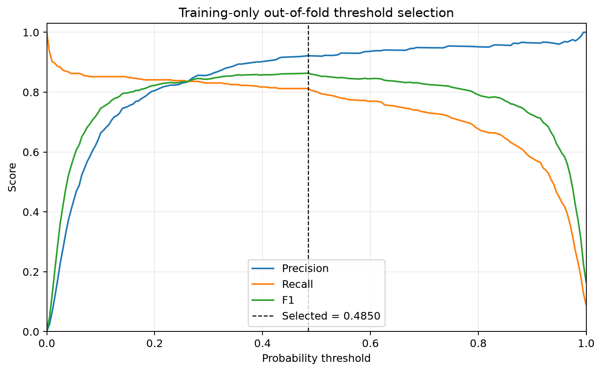

### Final test performance

Table 3 reports the single final evaluation of the frozen Random Forest. On the 56,746 test transactions, the model correctly identified 69 of the 95 fraud cases and missed 26. Only three of the 56,651 legitimate transactions were flagged incorrectly. Of the 72 transactions predicted as fraud, 69 were fraudulent, producing precision of 0.9583. Recall was 0.7263 and F1 was 0.8263.

| Measure | Final test result |
|---|---:|
| Accuracy | 0.99949 |
| Precision | 0.95833 |
| Recall | 0.72632 |
| F1-score | 0.82635 |
| Specificity | 0.99995 |
| ROC-AUC | 0.94281 |
| PR-AUC (average precision) | 0.81484 |
| True negatives | 56,648 |
| False positives | 3 |
| False negatives | 26 |
| True positives | 69 |

*Table 3. Single final evaluation on the untouched test partition at the frozen threshold of 0.485.*

The final PR-AUC of 0.8148 was lower than the selected candidate's mean cross-validation PR-AUC of 0.8368 but remained within one cross-validation standard deviation of 0.0321. Final recall was also lower than the mean cross-validation recall of 0.7936. This variation is plausible given that the test partition contains only 95 positive cases; it does not authorize further model or threshold selection. Accuracy remained above 99.9%, again illustrating why accuracy alone is not a useful discriminator for this rare-event task.

The three false positives indicate high precision on this partition, whereas the 26 false negatives show that a meaningful proportion of fraud remained undetected. The cost of those two error types cannot be compared directly because transaction-level operational costs were not provided. Consequently, the study reports the trade-off rather than claiming that threshold 0.485 is universally optimal.

The fitted pipeline is stored as `models/final_model.joblib`, with SHA-256 `3b13807fca9bf45934500150647b5208fb94520274e5a72a141bd4ef0790eb91`. Exact metrics and predictions are stored in `artifacts/metrics`. Figures 3 to 5 show the confusion matrix, ROC curve, and precision-recall curve.

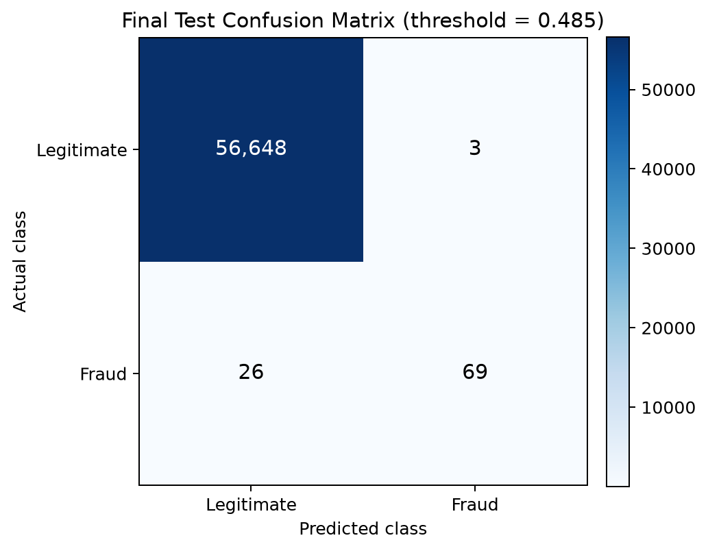

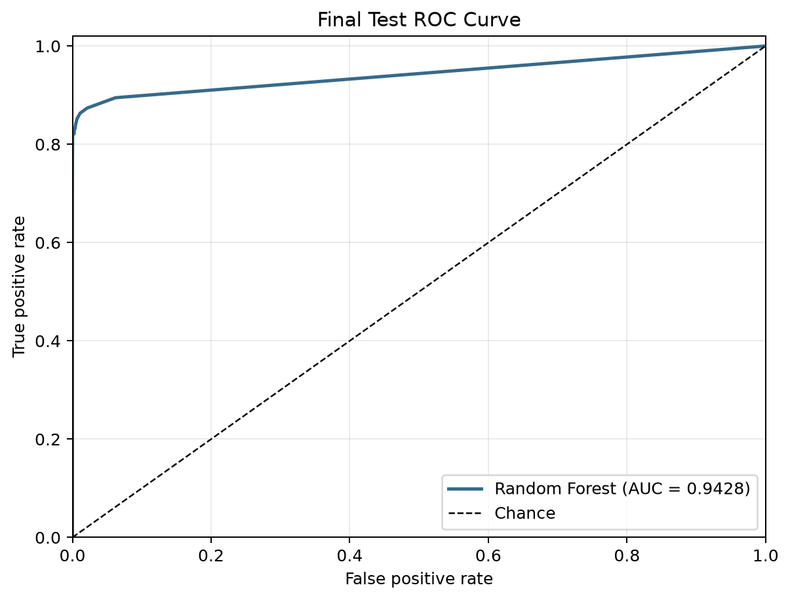

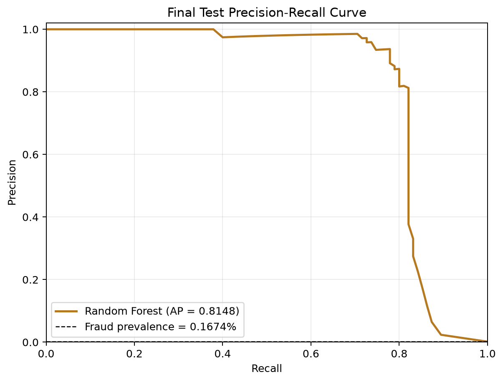

### SHAP global explanations

The prevalence-respecting training sample identified V12, V14, V4, V3, V11, V10, and V17 as the seven leading features by mean absolute SHAP value. Table 4 reports the ten highest values. Mean absolute SHAP measures the average magnitude of a feature's contribution to the fraud-class model output; it does not indicate a causal effect.

| Rank | Feature | Mean absolute SHAP |
|---:|---|---:|
| 1 | V12 | 0.07967 |
| 2 | V14 | 0.06880 |
| 3 | V4 | 0.05312 |
| 4 | V3 | 0.04874 |
| 5 | V11 | 0.04624 |
| 6 | V10 | 0.04622 |
| 7 | V17 | 0.03357 |
| 8 | V16 | 0.01779 |
| 9 | V7 | 0.01116 |
| 10 | V1 | 0.01032 |

*Table 4. Global mean absolute SHAP importance from the deterministic 2,000-observation training sample.*

Figure 6 shows the ranked global importance values, while Figure 7 shows feature value and contribution direction. Low observed values of V12 and V14 commonly contributed toward higher fraud scores, while higher V4 values commonly contributed in the same direction. These are aggregate patterns containing interactions and nonlinear splits, so they should not be interpreted as universal rules. The cohort comparison ranked V14, V12, V10, and V17 most strongly within known training fraud observations, with respective mean absolute SHAP values of 0.11791, 0.09111, 0.08003, and 0.07664. Their values were larger than in the legitimate cohort, particularly for V14, V10, and V17.

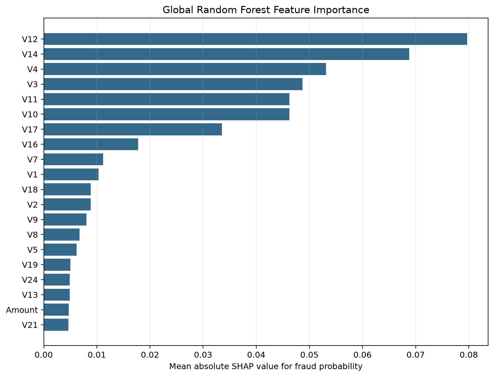

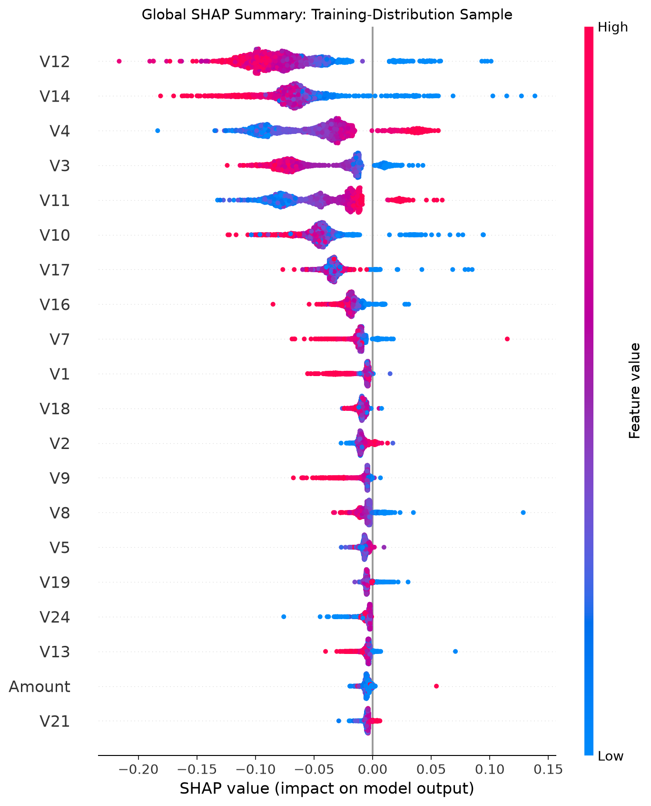

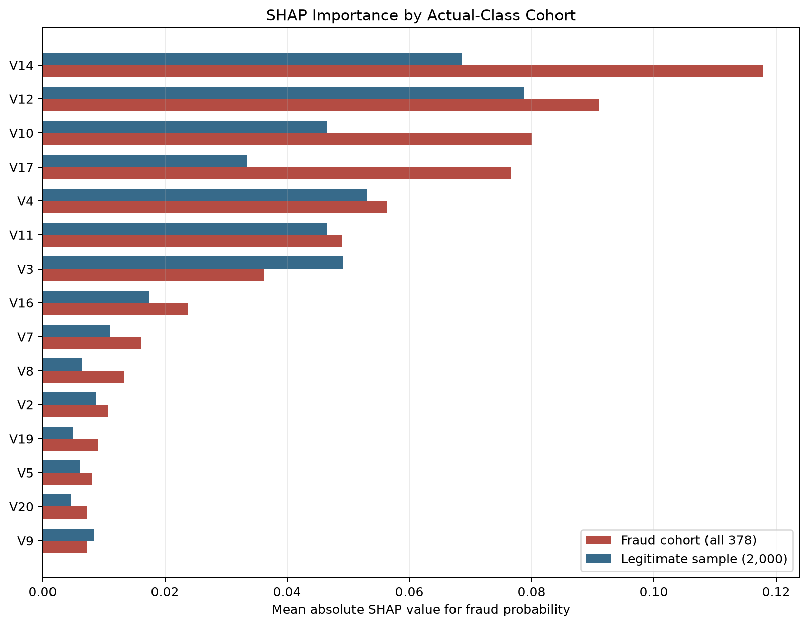

### SHAP local explanations

The representative true positive was test row 8,815. Its fraud probability was 0.965, and V14, V10, V12, V11, and V4 provided the five largest absolute contributions, all toward the fraud score. The representative true negative was test row 0 with probability 0.000; V12, V11, V3, V14, and V10 contributed most strongly toward a legitimate prediction.

The representative false positive was test row 49,255 with fraud probability 0.625. V17, V12, and V14 contributed strongly toward fraud, whereas V10 contributed in the opposite direction. The representative false negative was test row 47,606 with probability 0.015. Its strongest contributions from V4, V12, V11, V14, and V3 were all toward the legitimate class, illustrating how the model could assign a low fraud score to an actually fraudulent transaction.

Figures 9 to 12 show the four representative local explanations. The cases were chosen mechanically as the observation nearest the median fraud probability in each outcome category, reducing discretionary selection.

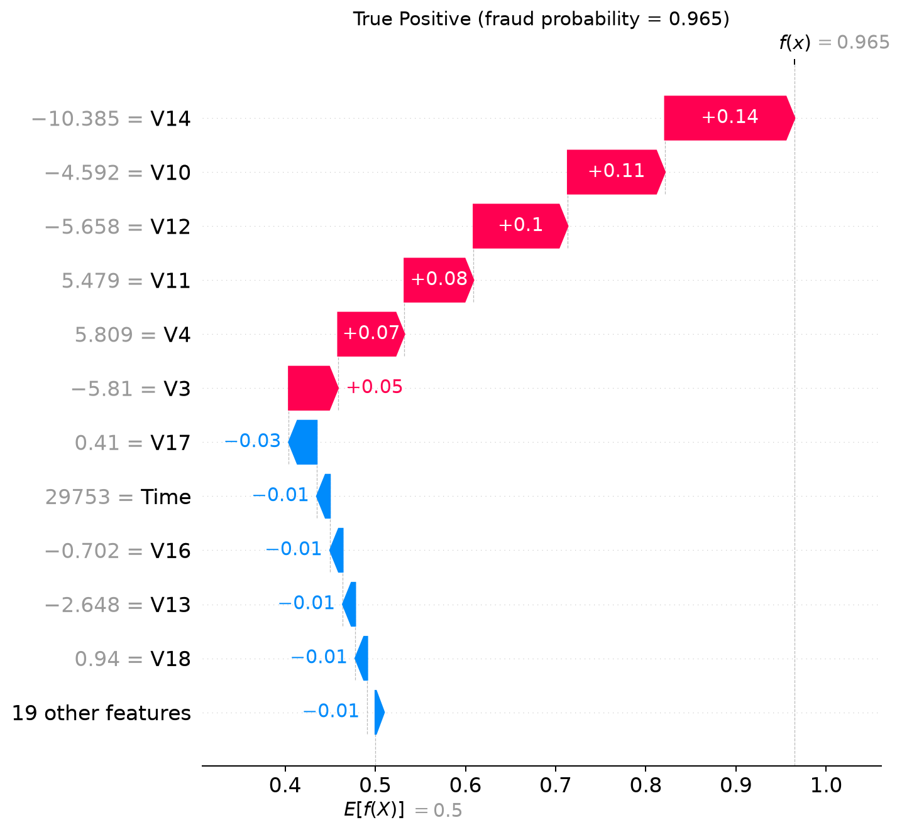

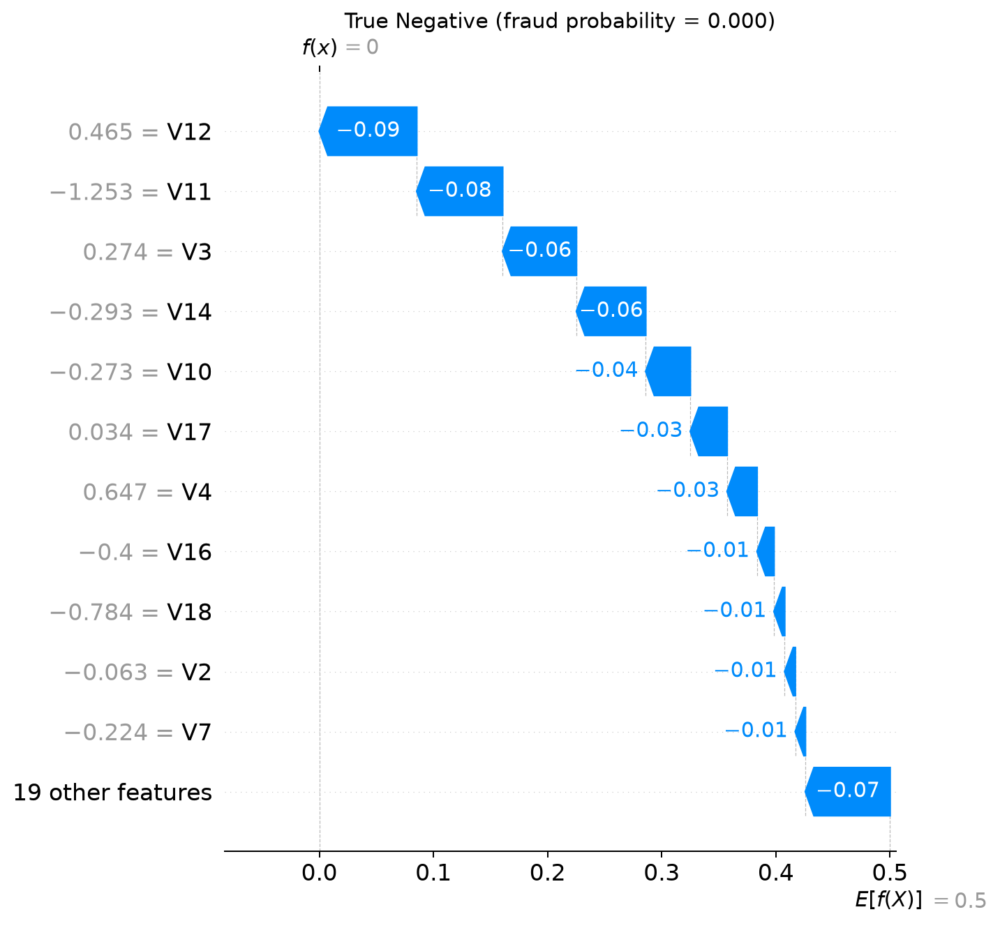

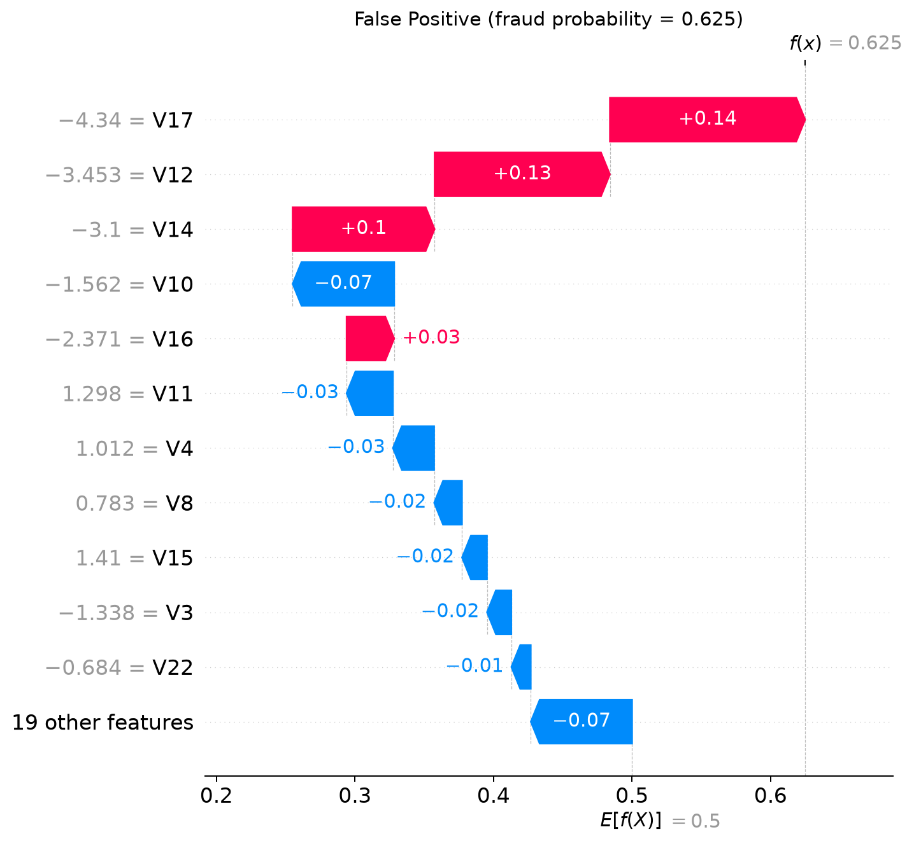

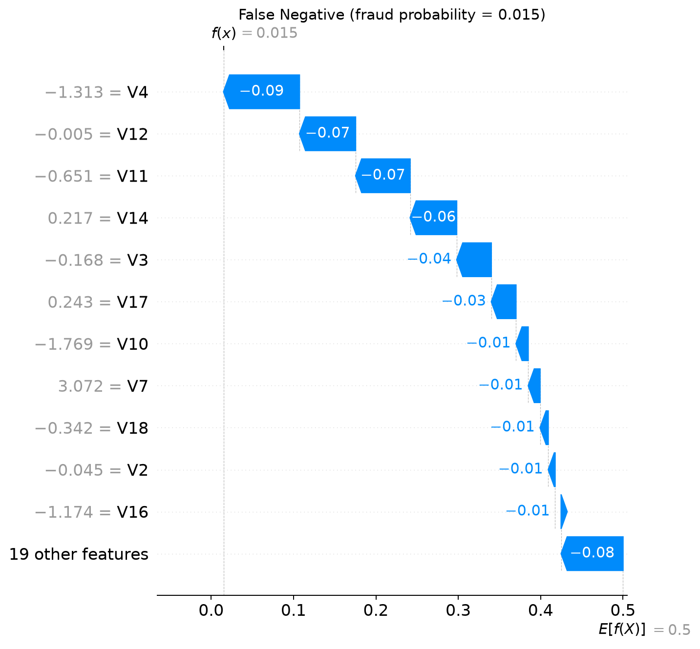

The maximum observed SHAP probability-reconstruction error was approximately 2.1 × 10^-11, confirming numerical additivity. Global, cohort, and local figures, the exact contribution tables, sampled row identifiers, compressed SHAP arrays, and reproducibility metadata are stored in `artifacts/shap`.

### Application verification

All 11 automated application tests passed with no failures. The Streamlit smoke test rendered the full page, invoked the Predict button using valid manual input, displayed the fraud probability and exact frozen threshold of 0.485, and generated the SHAP explanation without an exception. The separately launched local Streamlit server returned HTTP status 200 and response `ok` from `/_stcore/health`.

Tests against the four representative cases reproduced the immutable saved predictions and probabilities. Repeated inference on the same transaction returned identical output. The saved model SHA-256 remained `3b13807fca9bf45934500150647b5208fb94520274e5a72a141bd4ef0790eb91` after application testing, confirming that the demonstration did not modify the fitted artifact.

## Chapter 5 Discussion

The experimental results show that algorithm choice and imbalance treatment cannot be judged by accuracy. This agrees with the literature on rare-event evaluation: ROC-AUC and especially accuracy can appear strong even when positive predictions are not sufficiently reliable, whereas precision-recall analysis directly exposes minority-class performance (Davis and Goadrich, 2006; Saito and Rehmsmeier, 2015). Random Forest consistently provided stronger precision-recall ranking than Logistic Regression and Decision Tree. Balanced weighting produced a modest improvement for Random Forest but dramatically changed Logistic Regression's threshold-level behaviour: recall increased while precision and F1 deteriorated. The result confirms that weighting is not uniformly beneficial across learners.

SMOTE increased Random Forest recall but did not improve its primary PR-AUC criterion. This does not contradict the original SMOTE evidence, which presented synthetic oversampling as one component of an empirical strategy rather than a universal guarantee (Chawla et al., 2002). It instead illustrates that resampling must be tested in the intended pipeline and assessed against the chosen objective. Keeping SMOTE inside each fold ensured that the comparison measured generalization to untouched validation rows rather than leakage from synthetic examples.

The final test results broadly support the training-only selection while showing some generalization loss. PR-AUC decreased from a five-fold mean of 0.8368 to 0.8148, and recall decreased from 0.7936 to 0.7263. With only 95 fraud cases in the test partition, each fraud case changes recall by approximately 1.05 percentage points, so moderate variation should be expected. The model's three false positives and 26 false negatives also demonstrate that strong aggregate performance does not remove the operational error trade-off.

SHAP makes the Random Forest's individual scores inspectable even though the ensemble itself is not directly transparent. This use is consistent with SHAP's purpose as a unified additive feature-attribution method (Lundberg and Lee, 2017). The global and local results repeatedly feature V12, V14, V10, V11, V4, V3, and V17, but the direction and magnitude vary by observation. The false-positive and false-negative explanations are particularly important because they show that the same model features can combine differently across errors. However, anonymization means the explanations cannot be translated into operational concepts such as location, merchant type, or customer behaviour.

The global sample largely reflects legitimate observations because that is the real training distribution. The fraud-cohort supplement helps analyze minority behaviour, but its deliberately altered class composition means it cannot be read as a population-wide importance estimate. More generally, interpretability is audience- and context-dependent (Murdoch et al., 2019). The explanations are useful to a technical reviewer who understands V1 through V28 as anonymized variables, but they are insufficient for an investigator who needs domain-semantic reasons or for a customer who needs an actionable decision explanation.

The approximately 0.5001 SHAP reference output deserves particular caution. It results from the balanced class weighting and TreeExplainer's model reference; it is not the observed fraud rate and should not be presented as a base risk. This distinction is consistent with evidence that class-distribution changes and learning methods can alter probability calibration even when ranking remains useful (Dal Pozzolo et al., 2015; Niculescu-Mizil and Caruana, 2005). Calibration was not evaluated in this project, so the score supports classification and explanation at the frozen threshold but not claims about real-world fraud probability.

The application demonstrates that the complete experimental pipeline can be reused for individual inference and explanation rather than only producing offline tables. Input validation prevents several common schema and numerical failures, while the fixed threshold keeps application decisions aligned with the final evaluation. Nevertheless, successful local testing does not establish production readiness. The prototype lacks authentication, transaction-system integration, monitoring, drift detection, governance controls, and operational security assessment.

## Chapter 6 Conclusion

### Summary of findings

This dissertation developed a reproducible and explainable prototype for detecting fraudulent credit-card transactions under extreme class imbalance. The work progressed from dataset audit through duplicate removal, stratified partitioning, training-only model comparison, controlled imbalance experiments, threshold selection, one final test evaluation, SHAP explanation, and application testing. Each numerical claim is supported by a saved artifact, and the fitted model and threshold were not changed after the test results were observed.

### Answers to the research questions

1. **How effectively can the selected algorithms classify transactions?** All three algorithms achieved accuracy above 99.9%, but their minority-class performance differed substantially. On baseline cross-validation, PR-AUC ranged from 0.5711 for Decision Tree to 0.8334 for Random Forest. The final Random Forest obtained test precision of 0.9583, recall of 0.7263, F1 of 0.8263, and PR-AUC of 0.8148. It produced few false alerts but missed 26 of 95 fraud cases, so performance was strong but not complete.
2. **How do Logistic Regression, Decision Tree, and Random Forest compare?** Random Forest provided the strongest and most stable overall precision-recall performance. Logistic Regression achieved the highest baseline ROC-AUC but weaker recall and PR-AUC, demonstrating that ROC ranking alone did not identify the best fraud detector. Decision Tree recovered more fraud than baseline Logistic Regression but had the weakest PR-AUC and ROC-AUC.
3. **How does severe class imbalance affect performance?** The imbalance made accuracy uninformative and caused precision-recall trade-offs to dominate. Balanced weighting raised Logistic Regression recall but reduced its precision and F1 sharply. Weighting produced only a modest benefit for Random Forest, while SMOTE increased recall without improving PR-AUC. Imbalance handling therefore had model-specific effects and required fold-contained evaluation.
4. **Which anonymized features most strongly influence the final model?** The prevalence-respecting global SHAP analysis ranked V12, V14, V4, V3, V11, V10, and V17 highest by mean absolute contribution. The fraud-cohort supplement emphasized V14, V12, V10, and V17. These are model-behaviour findings rather than causal or business-semantic interpretations.
5. **To what extent does SHAP provide understandable individual explanations?** SHAP reconstructed model probabilities with negligible numerical error and showed which variables moved representative true-positive, true-negative, false-positive, and false-negative scores toward or away from fraud. It therefore makes individual model decisions technically inspectable. Understanding remains limited because the features are anonymized, the baseline is affected by class weighting, and additive contribution does not prove causality.

### Overall conclusion

The balanced 200-tree Random Forest was the most suitable of the evaluated configurations for this dataset and selection criterion. At the frozen threshold of 0.485, it combined very high precision with moderate-to-high fraud recall and outperformed the required baselines on PR-AUC. The study's central result is broader than the choice of algorithm: credible evaluation in rare-event fraud detection depends on leakage-safe validation, minority-sensitive metrics, explicit threshold selection, immutable final testing, and careful interpretation of explanations.

The Streamlit prototype demonstrates that the trained pipeline can be reused consistently for a single transaction and accompanied by a local explanation. It does not establish operational readiness. A real deployment would require institution-specific validation, authenticated and audited integration, cost-sensitive threshold governance, probability calibration, bias and privacy assessment, drift and data-quality monitoring, human review procedures, security testing, and a retraining and incident-response process.

### Recommendations for future work

Future work should evaluate temporally ordered splits to test concept drift; obtain transaction and investigation costs to select thresholds by expected utility; assess probability calibration; compare additional ensemble and anomaly-detection approaches under the same leakage controls; and validate on data from different periods or institutions. Richer, non-anonymized variables and sequential cardholder behaviour could improve both discrimination and explanation, provided privacy and governance requirements are met. Prospective evaluation should also measure alert workload, decision latency, investigator usefulness, and performance decay rather than relying only on static classification metrics.

## References

Abdallah, A., Maarof, M. A. and Zainal, A. (2016) 'Fraud detection system: A survey', *Journal of Network and Computer Applications*, 68, pp. 90-113. https://doi.org/10.1016/j.jnca.2016.04.007

Breiman, L. (2001) 'Random forests', *Machine Learning*, 45, pp. 5-32. https://doi.org/10.1023/A:1010933404324

Breiman, L., Friedman, J. H., Olshen, R. A. and Stone, C. J. (1984) *Classification and Regression Trees*. Belmont, CA: Wadsworth.

Chawla, N. V., Bowyer, K. W., Hall, L. O. and Kegelmeyer, W. P. (2002) 'SMOTE: Synthetic minority over-sampling technique', *Journal of Artificial Intelligence Research*, 16, pp. 321-357. https://doi.org/10.1613/jair.953

Dal Pozzolo, A., Boracchi, G., Caelen, O., Alippi, C. and Bontempi, G. (2018) 'Credit card fraud detection: A realistic modeling and a novel learning strategy', *IEEE Transactions on Neural Networks and Learning Systems*, 29(8), pp. 3784-3797. https://doi.org/10.1109/TNNLS.2017.2736643

Dal Pozzolo, A., Caelen, O., Johnson, R. A. and Bontempi, G. (2015) 'Calibrating probability with undersampling for unbalanced classification', in *2015 IEEE Symposium Series on Computational Intelligence*, pp. 159-166. https://doi.org/10.1109/SSCI.2015.33

Davis, J. and Goadrich, M. (2006) 'The relationship between Precision-Recall and ROC curves', in *Proceedings of the 23rd International Conference on Machine Learning*, pp. 233-240. https://doi.org/10.1145/1143844.1143874

King, G. and Zeng, L. (2001) 'Logistic regression in rare events data', *Political Analysis*, 9(2), pp. 137-163. https://doi.org/10.1093/oxfordjournals.pan.a004868

Lundberg, S. M. and Lee, S.-I. (2017) 'A unified approach to interpreting model predictions', in *Advances in Neural Information Processing Systems 30*, pp. 4765-4774. https://proceedings.neurips.cc/paper/2017/hash/8a20a8621978632d76c43dfd28b67767-Abstract.html

Murdoch, W. J., Singh, C., Kumbier, K., Abbasi-Asl, R. and Yu, B. (2019) 'Definitions, methods, and applications in interpretable machine learning', *Proceedings of the National Academy of Sciences*, 116(44), pp. 22071-22080. https://doi.org/10.1073/pnas.1900654116

Niculescu-Mizil, A. and Caruana, R. (2005) 'Predicting good probabilities with supervised learning', in *Proceedings of the 22nd International Conference on Machine Learning*, pp. 625-632. https://doi.org/10.1145/1102351.1102430

Saito, T. and Rehmsmeier, M. (2015) 'The precision-recall plot is more informative than the ROC plot when evaluating binary classifiers on imbalanced datasets', *PLOS ONE*, 10(3), e0118432. https://doi.org/10.1371/journal.pone.0118432

West, J. and Bhattacharya, M. (2016) 'Intelligent financial fraud detection: A comprehensive review', *Computers & Security*, 57, pp. 47-66. https://doi.org/10.1016/j.cose.2015.09.005

## Appendix A Reproducibility and artifact register

The project source is organized so that the experimental stages can be audited independently. `data/processed/split_metadata.json` records split provenance and checksums. Baseline, tuning, threshold, final-evaluation, and application-test records are stored in `artifacts/metrics`. Plots used in the dissertation are stored in `artifacts/figures` and `artifacts/shap`. The immutable fitted pipeline is `models/final_model.joblib`. The continuous experiment log is `docs/research_log.md`, and methodology decisions are recorded in `docs/methodology_decisions.md`.

The principal execution sequence is:

1. Run the dataset audit and exploratory analysis.
2. Remove exact duplicates and create the stratified training and locked test partitions.
3. Run baseline cross-validation on the training partition.
4. Run training-only imbalance and bounded tuning experiments, then freeze the model and out-of-fold threshold.
5. Run the single-use final evaluation against the locked test partition.
6. Generate SHAP global, cohort, and representative local explanations from the saved final model.
7. Run the application and automated tests without modifying the model artifact.

The final model SHA-256 is `3b13807fca9bf45934500150647b5208fb94520274e5a72a141bd4ef0790eb91`. The final application test record reports 11 tests, zero failures, and a successful live health check.
